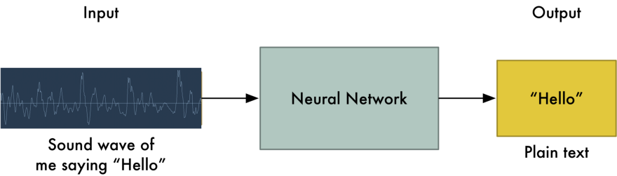
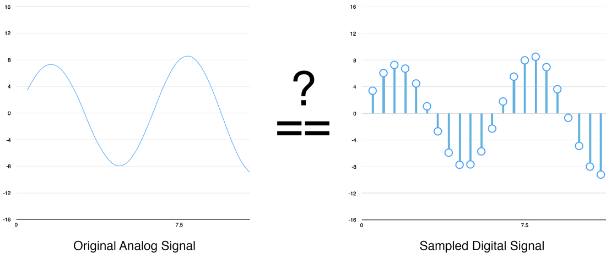
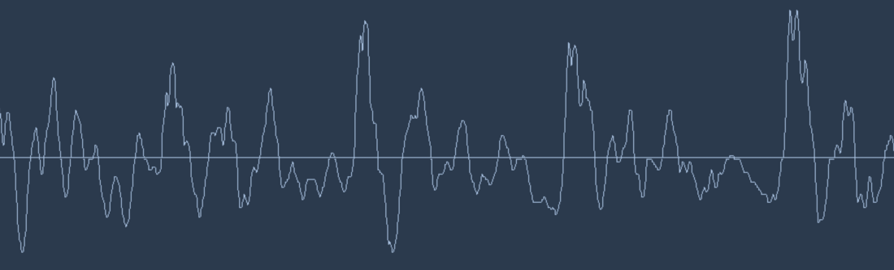
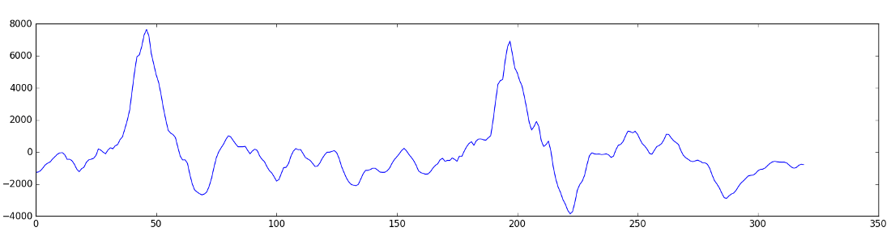
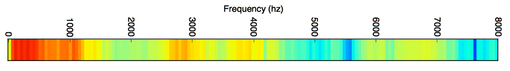
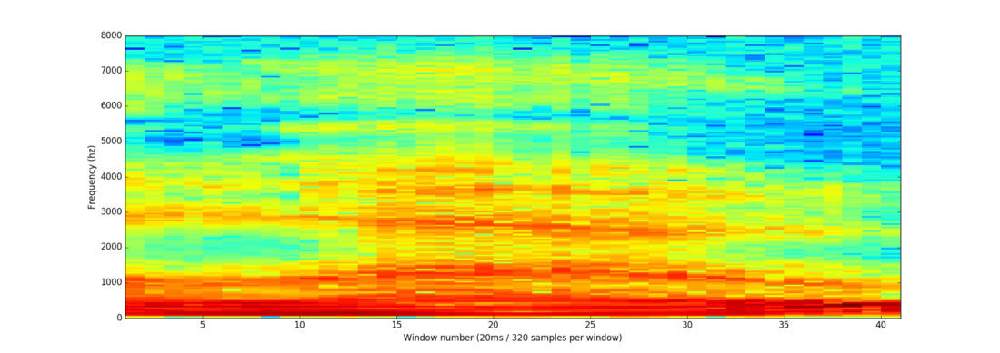

# Speech Recognition
## Introduction
Speech recognition is invading our lives. It's built into our phones, our game consoles and our smart watches. It's even automating our homes. 
We could simply feed sound recordings into neural network and train it to produce text:

Although that is therotically all we have to do, the entire technique has certain limitations. People speak with different pace, with different speeds. Ones speech might sound like a 'hello' while others might sould like a 'hellllllllo'. Despite of representing the same text hello, the two speech files might be significantly different. 
Converting sound to bits
We can 'sample' the sound wave by recording the height of wave at equally spaced points. A 16 kHz audio should have been sampled 16,000 times and is enough to sample everything human could possibly hear. How reliable is the sampling technique? Surprisingly, 100%. 

So, a waveform like this 

could be recorded as this. Please note that this is fraction of 20 ms of the entire clip. 

Using some clever transformations, you can generate a score of how important each frequency range is, which looks like the following. 

And when you repeat this every 20 ms, you get a spectogram. 

Neural Networks, especially Recurrant Neural Networks are expected to perform really well in classifying these patterns. 